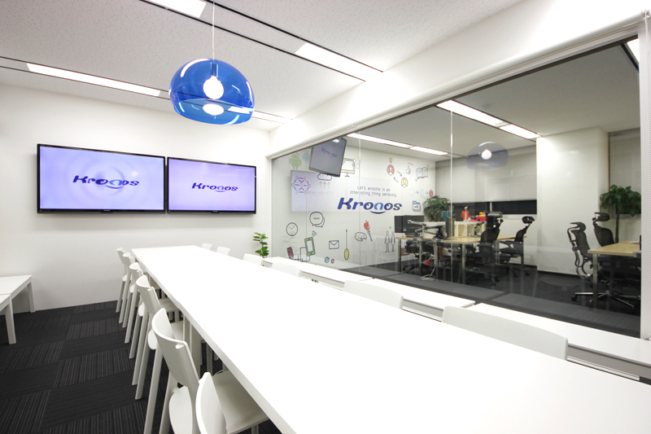

# DAY3 - ソフトウェア

## PART3 LPの開発

### Materialize

MaterializeはCSSフレームワークの1つです。マテリアルデザインのWebページを簡単に作成できるようになります。

http://materializecss.com/

> マテリアルデザイン（Material Design）は、アメリカ合衆国のGoogle社が提唱したユーザーエクスペリエンスデザインの体系、およびそれを実現する開発技術や手法、デザイン、試みなどの包括的呼称。 - Wikipedia

ここではMaterializeを使ってLPの開発にチャレンジします。

> Materialize以外にもBootstrapなど様々なCSSフレームワークがあります。  Bootstrap https://getbootstrap.com/


### 素材の準備

以下の2つの画像ファイルをダウンロードしておいてください

> top.jpg、entry.png は itcaret/images フォルダに配置します。

#### top.jpg




#### entry.png


### index.html

Materializeを使うための雛形を準備します。ファイル名はindex.htmlとしてください。

```html
<!DOCTYPE html>
<html>
<head>
  <meta charset="utf-8">
  <title>Materialize</title>
  <meta name="robots" content="noindex">
  <meta name="viewport" content="width=device-width, initial-scale=1">
  <link rel="stylesheet" href="https://cdnjs.cloudflare.com/ajax/libs/materialize/1.0.0-rc.2/css/materialize.min.css">
  <link href="https://fonts.googleapis.com/icon?family=Material+Icons" rel="stylesheet">
</head>
<body>

</body>
</html>
```

+ 1つ目のmetaタグは検索エンジンウェブクローラのインデックス登録対象外としています。
+ 2つ目のmetaタグはスマホで表示したときに最適なサイズを指定しています。
+ 1つ目のlinkタグは Materialize を読み込んでいます。
+ 2つ目のlinkタグは Googleの Material Icons を読み込んでいます。
  + https://design.google.com/icons/

> このような設定は手書きせずにコピペするようにします。

### mate01.html

ナビゲーションを作成します。既存のindex.htmlファイルにコードをコピペして追記してください。

```html
<nav class="green">
  <div class="nav-wrapper container">
    <a href="#" class="brand-logo">IT CARET</a>
    <ul id="nav-mobile" class="right hide-on-med-and-down">
      <li><a href="about.html">about</a></li>
    </ul>
  </div>
</nav>
```

+ 上記のコードはbodyタグの中に記述してください。
+ divタグは見た目の装飾のない汎用的なタグです。
+ Materializeでは便利なclass属性が用意されているので、それらを選んで指定していきます。
+ navタグはHTML5から導入されたナビゲーションを表現するタグです。
+ navタグのclass属性に"green"としています。"blue"にしてみてください。
  + http://materializecss.com/color.html どんな色が使えるか見ておきましょう。

### mate02.html

メインコンテンツを作成します。

```html
<div class="white">
  <div class="container">
    <div class="row">
      <div class="col s12 m5 l4">
        <h2>IT CARET</h2>
        <h6>[ Sub Title ]</h6>
        <h5>プログラミングスクール</h5>
      </div>
      <div class="col s12 m7 l8 section">
        
      </div>
    </div>
  </div>
</div>
```

+ 2つ目のdivタグのclass属性にcontainerを指定しています。これは左右に適切な余白をとります。
+ 3つ目のdivタグのclass属性に"row"、4つ目のdivタグには"col"を指定しています。これらの組み合わせは行と列を意味します。
+ 4つ目のdivタグのcalss属性の"s12 m7 l8"は列幅を指定しています。sはスマホ、mはタブレット、lはデスクトップをイメージしてください。1行の合計が12になるようにします。
+ "section"は上下に余白をとります。
+ "responsive-img"は画面サイズに合わせて画像を拡大・縮小します。

### mate03.html

メッセージを記述します。

```html
<div class="green white-text">
  <div class="container section">
    <div class="row">
      <div class="col s12 m12 l10 offset-l1">
        <h4 class="center">[ Concept ]</h4>
        <p style="font-size: 1.2rem;">
          [ IT CARETはxxxなプログラミングスクールです。IT CARETはxxxなプログラミングスクールです。IT CARETはxxxなプログラミングスクールです。IT CARETはxxxなプログラミングスクールです。IT CARETはxxxなプログラミングスクールです。IT CARETはxxxなプログラミングスクールです。IT CARETはxxxなプログラミングスクールです。IT CARETはxxxなプログラミングスクールです。 ]
        </p>
      </div>
    </div>
  </div>
</div>
```

+ "white-text"は白い文字色になります。"COLORNAME_text"で文字色を指定できます。
+ "offset-l1"は1列分のオフセット（空の列）をとります。
+ "center"は中央にテキストを表示します。

### mate04.html

3つの特徴をまとめます。

```html
<div class="white">
  <div class="container section">
    <div class="row">
      <div class="col s12 m4 l4">
        <div>
          <h2 class="center"><i class="material-icons" style="font-size: 4rem;" >computer</i></h2>
          <h5 class="center">[ Feature1 ]</h5>
          <p>
            [ IT CARETはxxxなプログラミングスクールです。IT CARETはxxxなプログラミングスクールです。IT CARETはxxxなプログラミングスクールです。IT CARETはxxxなプログラミングスクールです。]
          </p>
        </div>
      </div>
      <div class="col s12 m4 l4">
        <div class="icon-block">
          <h2 class="center"><i class="material-icons" style="font-size: 4rem;">gavel</i></h2>
          <h5 class="center">[ Feature2 ]</h5>
          <p>
            [ IT CARETはxxxなプログラミングスクールです。IT CARETはxxxなプログラミングスクールです。IT CARETはxxxなプログラミングスクールです。IT CARETはxxxなプログラミングスクールです。]
          </p>
        </div>
      </div>
      <div class="col s12 m4 l4">
        <div class="icon-block">
          <h2 class="center"><i class="material-icons" style="font-size: 4rem;">group_add</i></h2>
          <h5 class="center">[ Feature3 ]</h5>
          <p>
            [ IT CARETはxxxなプログラミングスクールです。IT CARETはxxxなプログラミングスクールです。IT CARETはxxxなプログラミングスクールです。IT CARETはxxxなプログラミングスクールです。]
          </p>
        </div>
      </div>
    </div>
  </div>
</div>
```

+ &lt;i class="material-icons" style="font-size: 4rem;" &gt;computer&lt;/i&gt; はGoogleのマテリアルアイコンを取得しています。
  + https://design.google.com/icons/ からお好みのアイコンを探してみましょう。


### mate05.html

申し込みフォームを作ります。

```html
<div class="green lighten-5">
  <div class="container section">
    <div class="row">
      <div class="col s12 m6 l6 center">
        <div class="section">
          
        </div>
      </div>
      <div class="col s12 m6 l6 center">
        <p class="left-align">
          メールアドレスを登録して頂くと最新の情報をお届けします。
        </p>
        <form action="#" method="post">
          <input placeholder="your_mail@example.com" type="text" >
          <input type="button" value="登録する" class="btn" onclick="alert('thank you.')">
        </form>
      </div>
    </div>
  </div>
</div>
```
+ "green lighten-5"と指定すると緑が薄くなります。lighten-1からlighten-5まで選べます。
+ HTMLのform、inputタグが初登場ですが、入力フォームを作るために使います。
+ 登録するボタンを押すとアラートが表示されます。JavaScriptを使っています。
+ メールアドレスを実際に登録するにはどうすればいいのでしょうか。。

### mate06.html

フッターを作ります。

```html
<footer class="green darken-1 white-text center">
  <div class="section">
    <h5>お問い合わせ先</h5>
    <ul>
      <li>株式会社クロノス</li>
      <li><a href="http://kronos-jp.net/" target="_blank" class="white-text">http://www.kronos-jp.net/</a></li>
    </ul>
  </div>
  <div class="footer-copyright">
    Kronos Co., Ltd.© Copyright 2017
  </div>
</footer>
```

+ "green darken-1"で緑を濃くできます。darken-1からdarken5まで選べます。


### ここまでの完成版

```html
<!DOCTYPE html>
<html>
<head>
  <meta charset="utf-8">
  <title>Materialize</title>
  <meta name="robots" content="noindex">
  <meta name="viewport" content="width=device-width, initial-scale=1">
  <link rel="stylesheet" href="https://cdnjs.cloudflare.com/ajax/libs/materialize/1.0.0-rc.2/css/materialize.min.css">
  <link href="https://fonts.googleapis.com/icon?family=Material+Icons" rel="stylesheet">
</head>
<body>
  <!-- Ex1 -->
  <nav class="green">
    <div class="nav-wrapper container">
      <a href="#" class="brand-logo">IT CARET</a>
      <ul id="nav-mobile" class="right hide-on-med-and-down">
        <li><a href="about.html">about</a></li>
      </ul>
    </div>
  </nav>

  <!-- Ex2 -->
  <div class="white">
    <div class="container">
      <div class="row">
        <div class="col s12 m5 l4">
          <h2>IT CARET</h2>
          <h6>[ Sub Title ]</h6>
          <h5>プログラミングスクール</h5>
        </div>
        <div class="col s12 m7 l8 section">
          
        </div>
      </div>
    </div>
  </div>

  <!-- Ex3 -->
  <div class="green white-text">
    <div class="container section">
      <div class="row">
        <div class="col s12 m12 l10 offset-l1">
          <h4 class="center">[ Concept ]</h4>
          <p style="font-size: 1.2rem;">
            [ IT CARETはxxxなプログラミングスクールです。IT CARETはxxxなプログラミングスクールです。IT CARETはxxxなプログラミングスクールです。IT CARETはxxxなプログラミングスクールです。IT CARETはxxxなプログラミングスクールです。IT CARETはxxxなプログラミングスクールです。IT CARETはxxxなプログラミングスクールです。IT CARETはxxxなプログラミングスクールです。 ]
          </p>
        </div>
      </div>
    </div>
  </div>

  <!-- Ex4 -->
  <div class="white">
    <div class="container section">
      <div class="row">
        <div class="col s12 m4 l4">
          <div>
            <h2 class="center"><i class="material-icons" style="font-size: 4rem;" >computer</i></h2>
            <h5 class="center">[ Feature1 ]</h5>
            <p>
              [ IT CARETはxxxなプログラミングスクールです。IT CARETはxxxなプログラミングスクールです。IT CARETはxxxなプログラミングスクールです。IT CARETはxxxなプログラミングスクールです。]
            </p>
          </div>
        </div>
        <div class="col s12 m4 l4">
          <div class="icon-block">
            <h2 class="center"><i class="material-icons" style="font-size: 4rem;">gavel</i></h2>
            <h5 class="center">[ Feature2 ]</h5>
            <p>
              [ IT CARETはxxxなプログラミングスクールです。IT CARETはxxxなプログラミングスクールです。IT CARETはxxxなプログラミングスクールです。IT CARETはxxxなプログラミングスクールです。]
            </p>
          </div>
        </div>
        <div class="col s12 m4 l4">
          <div class="icon-block">
            <h2 class="center"><i class="material-icons" style="font-size: 4rem;">group_add</i></h2>
            <h5 class="center">[ Feature3 ]</h5>
            <p>
              [ IT CARETはxxxなプログラミングスクールです。IT CARETはxxxなプログラミングスクールです。IT CARETはxxxなプログラミングスクールです。IT CARETはxxxなプログラミングスクールです。]
            </p>
          </div>
        </div>
      </div>
    </div>
  </div>

  <!-- Ex5 -->
  <div class="green lighten-5">
    <div class="container section">
      <div class="row">
        <div class="col s12 m6 l6 center">
          <div class="section">
            
          </div>
        </div>
        <div class="col s12 m6 l6 center">
          <p class="left-align">
            メールアドレスを登録して頂くと最新の情報をお届けします。
          </p>
          <form action="#" method="post">
            <input placeholder="your_mail@example.com" type="text" >
            <input type="button" value="登録する" class="btn" onclick="alert('thank you.')">
          </form>
        </div>
      </div>
    </div>
  </div>

  <!-- Ex6 -->
  <footer class="green darken-1 white-text center">
    <div class="section">
      <h5>お問い合わせ先</h5>
      <ul>
        <li>株式会社クロノス</li>
        <li><a href="http://kronos-jp.net/" target="_blank" class="white-text">http://www.kronos-jp.net/</a></li>
      </ul>
    </div>
    <div class="footer-copyright">
      Kronos Co., Ltd.© Copyright 2017
    </div>
  </footer>
</body>
</html>
```
