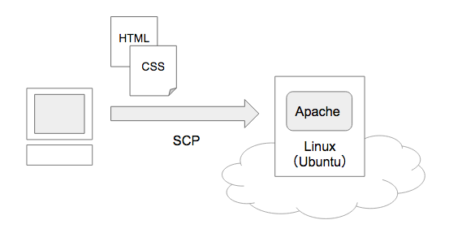

# DAY3 - ソフトウェア

## Webページのリリース

ローカルで開発したWebページをインターネット上に公開してみましょう。ここではクラウドサービスを活用します。

|サービス名|難易度|特徴|
|:--|:--|:--|
|AWS（EC2）|Hard|カスタマイズ性が高い|
|Digital Ocean|Easy|手軽にLinuxサーバを構築できる|
|Netlify|Very Easy|静的サイトのホスティング|

> いずれも有料のサービスで、クレジットカードの登録などが必要です。

ここではDigital Oceanを使ってWebページを公開していきます。

1. クラウドサービス（Digital Ocean）上でLinuxサーバを構築する。
1. Linux上にWebサーバ（Apache）をインストールする。
1. ローカルで作成したWebページをLinuxサーバにアップロードする。

