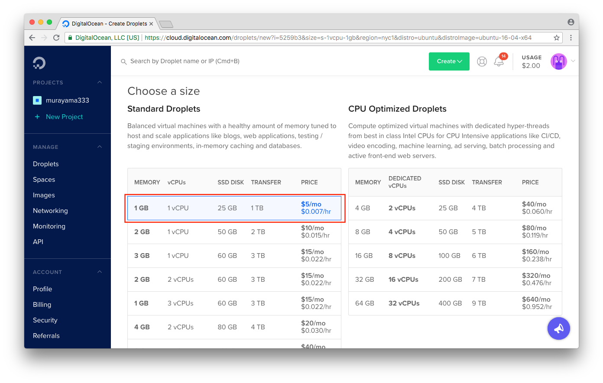
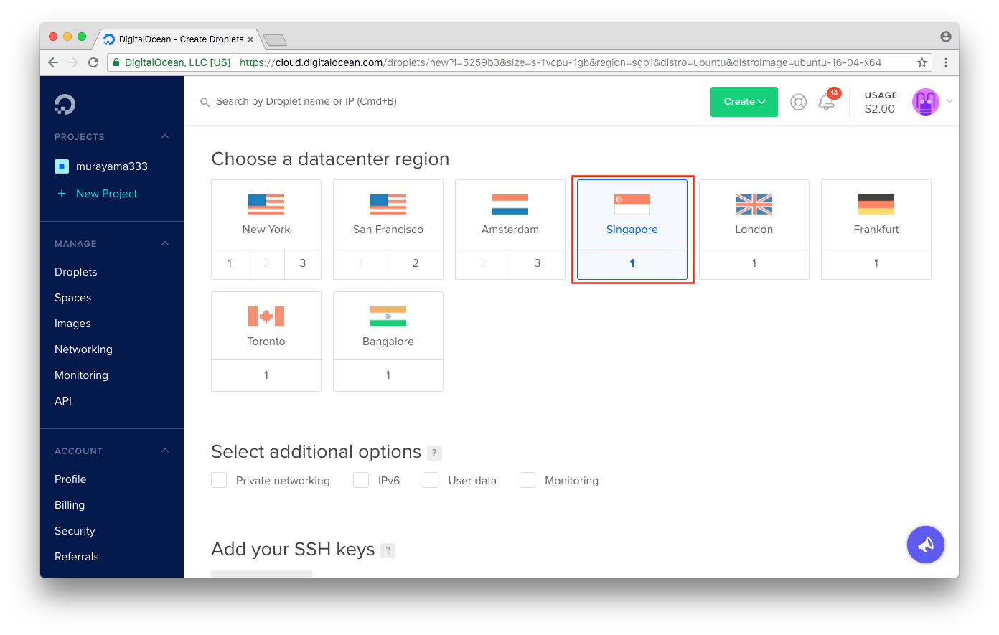

# DAY3 - ソフトウェア

## Digital Ocean

Digital Oceanはシンプルで使いやすいクラウドサービスです。数秒でクラウド上にLinuxサーバを準備できます。

https://www.digitalocean.com/

> 以降の作業はアカウントが必要なため講師が担当します。

---

## Linux（Ubuntu）サーバの起動

画面のサイドバーからDropletをクリックします。

画面中央のCreate Dropletをクリックします。

Choose an imageで Ubuntuを選択します。

Choose an imageで 1GBを選択します。

Choose an datacenter regionで Singaporeを選択します。

Createボタンをクリックします。

以上で準備は完了です。

> パスワード認証や秘密鍵認証についても確認しておくと良いでしょう。

### 注意

+ ここで作成したクラウドサーバは時間あたりで課金が発生します。1GBの場合は0.007$/Hです。
+ サーバは破棄するまで課金の対象となります。
+ セキュリティについて学びましょう。脆弱性のあるサーバを構築することは、自分が被害者になるだけでなく加害者となる可能性もあります。
  + 本日構築したサーバは24H後に削除しておきます。
